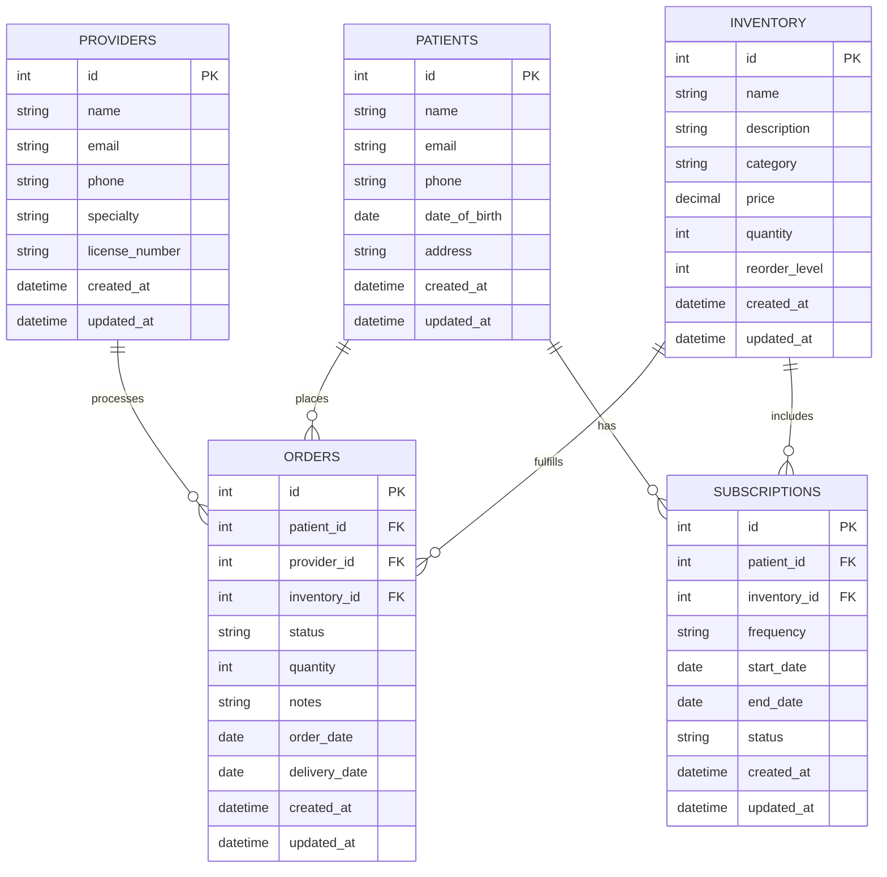

# Healthcare System Architecture

## Architecture Overview

### Directory Organization

app/
 ├── Http/
 │   ├── Controllers/
 │   │   └── OrderController.php
 │   │   └── ProfileController.php
 │   │   └── ProductController.php 
 │   ├── Middleware/
 │   │   └── AuthMiddleware.php
 │   │   └── RoleMiddleware.php
 │   ├── Requests/
 │   │   └── StoreProductRequest.php
 │   │   └── StoreOrderRequest.php
 │   ├── Policies/
 │   │   └── OrderPolicy.php
 │   ├── Services/
 │   │   └── OrderService.php
 │   ├── Middleware/
 │   └── ...
 ├── Mail/
 │   └── OrderPlaced.php
 ├── Models/
 │   ├── Order.php
 │   └── Product.php
 │   └── User.php
 ├── Policies/
 │   └── OrderPolicy.php
 └── Services/
     └── OrderService.php

database/
 ├── migrations/
 └── seeders/

resources/
 ├── views/
 │   ├── products/
 │   ├── orders/
 │   └── emails/
 └── components/

routes/
 └── web.php

### Core Architectural Components

1. **Requests (`app/Http/Requests/`)***
   - **Form Request Validation**: Dedicated classes that handle input validation and authorization for incoming HTTP requests
   - **Separation of Concerns**: Keeps validation logic out of controllers, making the code more maintainable
   - **Automatic Redirection**: Handles failed validation by redirecting users back with their input and validation errors
   - **Authorization**: Can be used to authorize that a user has permission to perform the requested action
   - **Example Files**:
     - `StoreOrderRequest.php` - Validates order creation
     - `StoreProductRequest.php` - Validates product creation/updates

2. **Policies (`app/Policies/`)***
   - **Authorization Logic**: Centralizes authorization logic for a particular model or resource
   - **Resource-Based Access Control**: Defines what actions a user can perform on a resource
   - **Method Conventions**: Uses methods like `viewAny`, `view`, `create`, `update`, `delete`
   - **Example**: `OrderPolicy.php` might include methods to check if a user can view, create, update, or delete orders
   - **Integration**: Automatically integrated with Laravel's Gate and authorization systems

3. **Services (`app/Services/`)***
   - **Business Logic Layer**: Houses complex business logic that doesn't belong in controllers or models
   - **Single Responsibility**: Each service class handles a specific domain of functionality
   - **Reusability**: Promotes code reuse across different parts of the application
   - **Testability**: Makes unit testing easier by separating concerns
   - **Example**: `OrderService.php` might handle order processing, inventory updates, and notifications

4. **Controllers (`app/Http/Controllers/`)***
   - **Request Handling**: Receives HTTP requests and returns responses
   - **Thin Controllers**: Primarily responsible for delegating work to services and returning appropriate responses
   - **Organized by Resource**: Grouped by resource type (e.g., OrderController, ProductController)
   - **Follows RESTful Conventions**: Uses standard CRUD operations (index, create, store, show, edit, update, destroy)
   - **Example Files**:
     - `OrderController.php` - Handles order-related requests
     - `ProductController.php` - Manages product operations
     - `ProfileController.php` - Handles user profile management

2. **app/Models**
   - Contains Eloquent models representing database tables
   - Each model corresponds to a major business entity (User, Product, Order, etc.)

3. **database/migrations**
   - Version-controlled database schema definitions
   - Named with timestamps for proper ordering

4. **resources/views**
   - Organized by feature and component type
   - Uses Blade templating engine
   - Follows component-based architecture

5. **routes/**
   - Separated by concern (web, api, console, channels)
   - Web routes include session state and CSRF protection
   - API routes are stateless and use token authentication

### Key Design Decisions

1. **Separation of Concerns**
   - Clear separation between business logic (Models), presentation (Views), and application flow (Controllers)
   - Service layer pattern for complex business logic

2. **API-First Approach**
   - Backend serves both web and API requests
   - API endpoints are versioned for future compatibility

3. **Frontend Architecture**
   - Progressive enhancement approach
   - JavaScript organized by feature
   - Uses Laravel Mix for asset compilation

4. **Testing**
   - Feature tests for critical user flows
   - Unit tests for business logic
   - Database transactions for test isolation

## Entity Relationship Diagram (ERD)

## System Overview

The healthcare system is designed to manage patient care through a comprehensive platform that connects patients, healthcare providers, and medical inventory. At its core, the system maintains detailed patient records and enables healthcare providers to manage patient orders efficiently.

Patients can place orders for medical supplies or services, which are processed by healthcare providers. The inventory system tracks medical supplies, automatically managing stock levels and triggering reorder alerts when quantities fall below specified thresholds. A subscription service allows for recurring orders of medical supplies, ensuring patients receive their necessary items on a regular schedule without manual reordering.

The system maintains a complete audit trail of all transactions and patient interactions, supporting compliance with healthcare regulations. Role-based access control ensures that sensitive patient data is only accessible to authorized personnel, while a user-friendly interface streamlines workflows for both healthcare providers and administrative staff.

## Technical Stack

- **Backend Framework:** Laravel 10.x
- **Frontend:** Blade templates, Livewire, Alpine.js
- **Database:** MySQL 8.0+
- **Authentication:** Laravel Breeze with role-based access
- **Testing:** PHPUnit, Pest
- **Deployment:** Laravel Forge / Envoyer
- **Monitoring:** Laravel Horizon, Telescope
